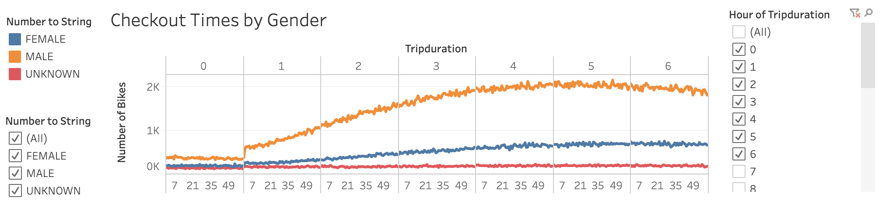

# bikesharing

## Background and Purpose

This analysis is based on NYC Citi Bikes which are a form rideshare transportation. The reason for analyzing this data is to help aid in a proposal to key stakeholders on whether or not it is a solid buisness plan to expand. To start off, data engineering was performed on a csv file to change the datetype of a column in order to create time series graphs in Tableau (NYC_CitiBike_Challenge.ipynb). Next using Tableau, I created visualizations that show the differences of rides based on a large amount of criteria. Next I used all of this information to create a store ending with an dashboard and summary based on all the data at hand and the results.

## Results and Analysis

Below I will attach screenshots of the output and analysis with explanations but my link to my Tableau story with 7 visualizations is --> ...[NYC_BIKE_STORY](https://public.tableau.com/profile/nicholas.singh#!/vizhome/NYC_CITI_BIKES/TripsbyWeekdayforEachHour?publish=yes "NYC BIKE STORY") 

* #### Clearly shows the most active time is around 4-7 hours with a big dip around 1-4 hours and a steady decline from 7- 23 hours.

* #### Clearly shows the most active out of male and females are males during a 6 hour span.

* #### Clearly shows the most active time is around 4-7 hours with a big dip around 1-4 hours and a steady decline from 7- 23 hours.

* #### Clearly shows the most active time is 6AM-9AM and 4PM-7PM with Saturdays being the busiest day.

* #### Clearly that males and females are active on the same days but also displays that males outnumber the fmeales signficantly.

## Summary

So after obtaining all of this data and looking at these visualizations, we still have to remember the task at hand which is whether or not this is good enough to convince stakeholders if they would want to invest to expand. Well we have to look back at the data, its clear that the big take away from this data is that males make up the majority of the bikes users but that doesnt mean there is not opportunity there. One very interesting thing that I took away from the analysis is that while men did outnumber women in number of rides , the locations of which they started and ended from were often the same. Meaning that in popular areas both genders were more likely to ride the bikes and for longer periods of time. Therefore I believe that with proper reasearch into new markets such as Des Moines and being able to locate high traffic points and tourist locations, it would be bound to succeed. This data shows there is clear amount of money to be made but it just depends on location and timing. 

